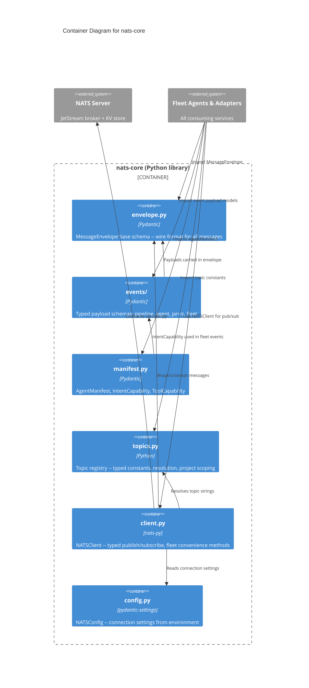

# C4 Container Diagram -- nats-core

## Container Diagram

_Dependency flow: Client -> Topics -> Events -> Envelope, with Config feeding Client only. All consumer imports flow into the library boundary._
