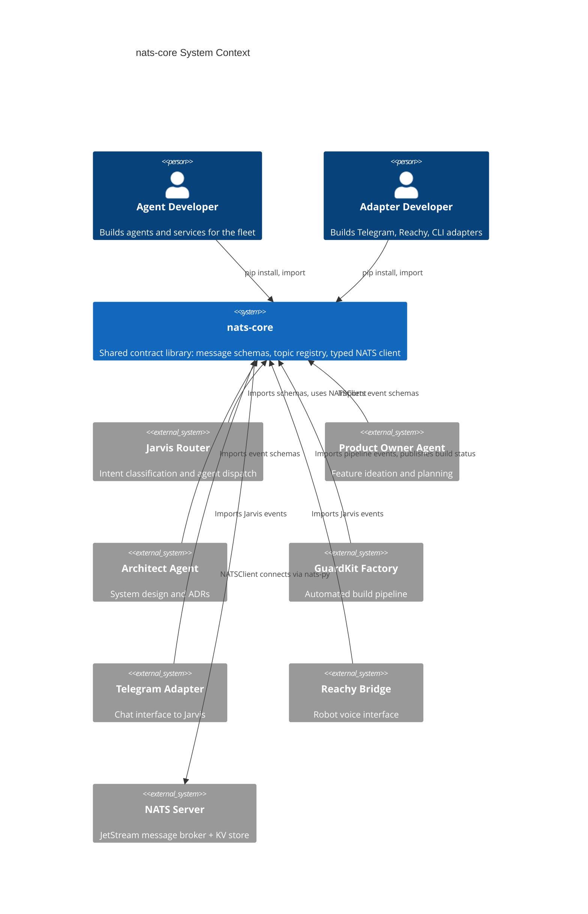

# C4 System Context -- nats-core

## System Context Diagram

_All fleet consumers depend on nats-core for schemas and typed pub/sub. The single outbound dependency is the NATS server, accessed via the NATSClient module._
