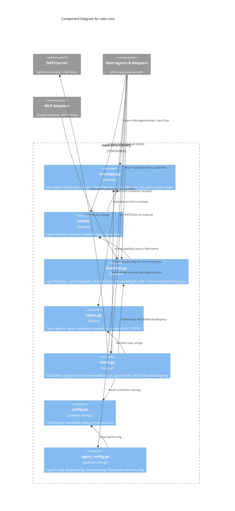

# C4 Level 3: nats-core Component Diagram

**Container:** nats-core (Python library)
**Date:** 2026-04-07

---

## Component Diagram



---

## Dependency Chain

```
Config  ->  Client  ->  Topics  ->  Events  ->  Envelope
                |                      |
            AgentConfig            Manifest
```

- **Envelope** is the foundation -- no dependencies within the library
- **Events** depend on Envelope (payload schemas carried in envelope)
- **Manifest** depends on Events (IntentCapability used in fleet domain)
- **Topics** is standalone -- pure constants
- **Client** depends on Config, Topics, Envelope, Manifest
- **AgentConfig** depends on Config (nests NATSConfig)
- **Config** is standalone -- pure pydantic-settings

---

## Component Responsibilities

| Component | Internal Deps | External Deps | LOC (est.) |
|-----------|--------------|---------------|------------|
| `envelope.py` | None | pydantic | ~60 |
| `events/` | envelope | pydantic | ~200 |
| `manifest.py` | events | pydantic, abc | ~120 |
| `topics.py` | None | None | ~80 |
| `client.py` | config, topics, envelope, manifest | nats-py, pydantic | ~250 |
| `config.py` | None | pydantic-settings | ~30 |
| `agent_config.py` | config | pydantic, pydantic-settings | ~80 |
