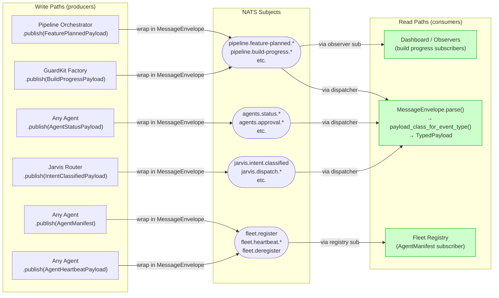
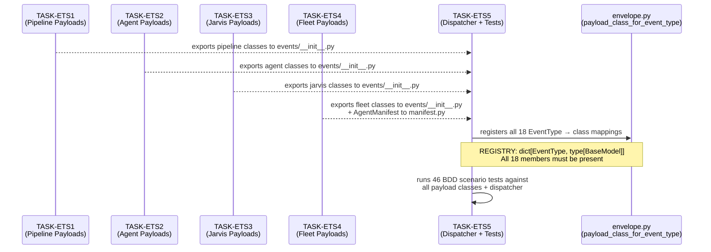
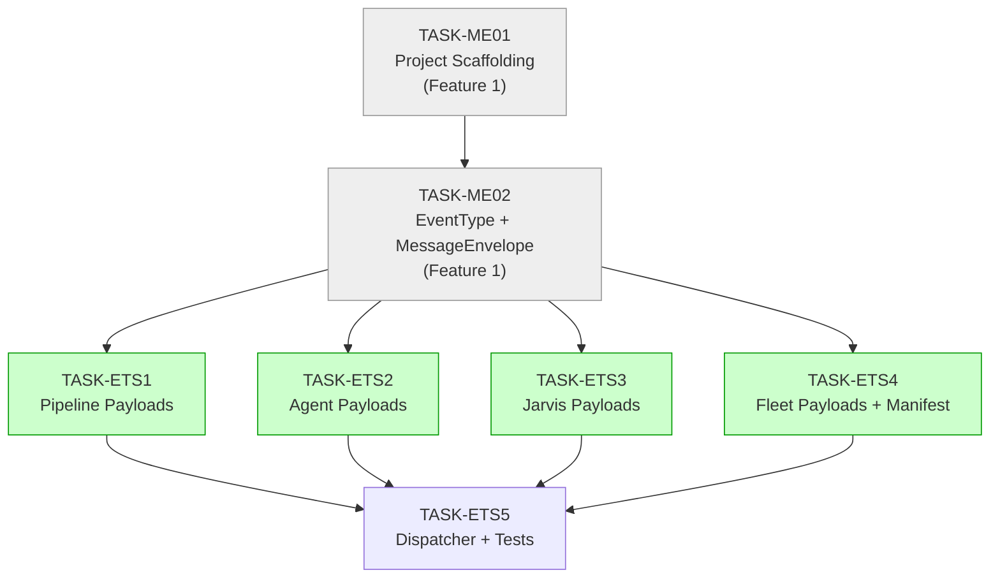

# Implementation Guide: Event Type Schemas (FEAT-ETS)

**Feature:** Event Type Schemas
**Review Task:** TASK-ETS0
**Approach:** Domain-per-task (Option 1) — 4 parallel domain tasks, then dispatcher + tests

---

## Data Flow: Read/Write Paths



_All write paths wrap a typed payload in `MessageEnvelope`. All read paths decode via
`payload_class_for_event_type(envelope.event_type).model_validate(envelope.payload)`._

---

## Integration Contracts



_ETS1–4 run in parallel (Wave 1). ETS5 starts only after all Wave 1 tasks complete
(Wave 2). The dispatcher registry in `envelope.py` is the integration boundary._

---

## Task Dependencies



_Green tasks (ETS1–4) can run in parallel. Grey tasks are Feature 1 prerequisites
that must complete first. ETS5 waits for all green tasks._

---

## §4: Integration Contracts

Cross-task data dependencies exist: TASK-ETS1–4 each produce a Python module that
TASK-ETS5 imports to populate the dispatcher registry.

### Contract: PIPELINE_PAYLOAD_CLASSES

- **Producer task:** TASK-ETS1
- **Consumer task:** TASK-ETS5
- **Artifact type:** Python module (`nats_core.events._pipeline`)
- **Format constraint:** All 6 classes (`FeaturePlannedPayload`, `FeatureReadyForBuildPayload`, `BuildStartedPayload`, `BuildProgressPayload`, `BuildCompletePayload`, `BuildFailedPayload`) must be importable from `nats_core.events` and each must be a `BaseModel` subclass with a `model_fields` attribute
- **Validation method:** Seam test `test_pipeline_payload_classes_registered()` in TASK-ETS5 iterates all pipeline `EventType` members and calls `payload_class_for_event_type()`, asserting each returns a Pydantic model

### Contract: AGENT_PAYLOAD_CLASSES

- **Producer task:** TASK-ETS2
- **Consumer task:** TASK-ETS5
- **Artifact type:** Python module (`nats_core.events._agent`)
- **Format constraint:** All 5 classes (`AgentStatusPayload`, `ApprovalRequestPayload`, `ApprovalResponsePayload`, `CommandPayload`, `ResultPayload`) importable from `nats_core.events`; `ERROR` EventType maps to `AgentStatusPayload` (same class as `STATUS`)
- **Validation method:** Seam test `test_agent_payload_classes_registered()` in TASK-ETS5

### Contract: JARVIS_PAYLOAD_CLASSES

- **Producer task:** TASK-ETS3
- **Consumer task:** TASK-ETS5
- **Artifact type:** Python module (`nats_core.events._jarvis`)
- **Format constraint:** All 4 classes (`IntentClassifiedPayload`, `DispatchPayload`, `AgentResultPayload`, `NotificationPayload`) importable from `nats_core.events`
- **Validation method:** Seam test `test_jarvis_payload_classes_registered()` in TASK-ETS5

### Contract: FLEET_PAYLOAD_CLASSES

- **Producer task:** TASK-ETS4
- **Consumer task:** TASK-ETS5
- **Artifact type:** Python modules (`nats_core.events._fleet`, `nats_core.manifest`)
- **Format constraint:** `AgentManifest` (from `nats_core.manifest`) registered for `EventType.AGENT_REGISTER`; `AgentHeartbeatPayload` for `AGENT_HEARTBEAT`; `AgentDeregistrationPayload` for `AGENT_DEREGISTER`
- **Validation method:** Seam test `test_fleet_payload_classes_registered()` in TASK-ETS5

---

## Module Structure

```
src/nats_core/
    __init__.py              # Re-exports all public payload classes
    envelope.py              # MessageEnvelope, EventType, payload_class_for_event_type()
    manifest.py              # AgentManifest, IntentCapability, ToolCapability [TASK-ETS4]
    events/
        __init__.py          # Re-exports all domain payload classes
        _pipeline.py         # 6 pipeline payloads + WaveSummary, TaskProgress [TASK-ETS1]
        _agent.py            # 5 agent payloads [TASK-ETS2]
        _jarvis.py           # 4 Jarvis payloads [TASK-ETS3]
        _fleet.py            # 2 fleet payloads [TASK-ETS4]

tests/
    test_event_type_schemas.py  # 46 BDD scenario tests [TASK-ETS5]
```

---

## Key Design Decisions

### Assumption Decisions

| Assumption | Decision | Rationale |
|------------|----------|-----------|
| ASSUM-007: No max_length on strings | Accept — do NOT add constraints | Spec says "payload should accept the value without constraint"; consumers handle display truncation |
| ASSUM-008: kebab-case agent_id | Implement — `Field(pattern=r"^[a-z][a-z0-9-]*$")` | BDD spec has explicit scenario "Agent registration rejects invalid agent_id format" |

### Naming: AgentRegistrationPayload vs AgentManifest

The BDD spec refers to "AgentRegistrationPayload" but DDR-002 establishes `AgentManifest`
as the full registration payload. Implement as `AgentManifest` per the design contract.
Document this in `src/nats_core/manifest.py` with a docstring note.

### Cross-Field Validators

Two payload classes require Pydantic v2 `@model_validator(mode="after")`:

1. `BuildProgressPayload`: `wave <= wave_total`
2. `BuildCompletePayload`: `tasks_completed + tasks_failed == tasks_total`
3. `FeaturePlannedPayload`: `len(waves) == wave_count`

Use `@model_validator(mode="after")` — do NOT use `@field_validator` for cross-field logic.

### Schema Versioning (ADR-002)

All payload models use `ConfigDict(extra="ignore")` to tolerate forward-compatible
additions. New fields must always be optional with defaults.

---

## Execution Strategy

```
Wave 1 (parallel):
  TASK-ETS1 — Pipeline payloads       → src/nats_core/events/_pipeline.py
  TASK-ETS2 — Agent payloads          → src/nats_core/events/_agent.py
  TASK-ETS3 — Jarvis payloads         → src/nats_core/events/_jarvis.py
  TASK-ETS4 — Fleet payloads/manifest → src/nats_core/events/_fleet.py + manifest.py

Wave 2 (sequential, after Wave 1 complete):
  TASK-ETS5 — Dispatcher + 46 tests  → envelope.py (dispatcher) + tests/test_event_type_schemas.py
```

**Prerequisite check before starting Wave 1:**
- TASK-ME01 status = complete (project scaffolding exists)
- TASK-ME02 status = complete (EventType enum + dispatcher stub exist)

---

## Cross-Feature Dependencies

| This Feature | Depends On | What It Needs |
|-------------|-----------|---------------|
| FEAT-ETS | FEAT-ME (TASK-ME01) | `src/nats_core/events/` sub-package created as empty |
| FEAT-ETS | FEAT-ME (TASK-ME02) | `EventType` enum with all 18 values; `payload_class_for_event_type()` stub |
| FEAT-FR (Fleet Reg) | FEAT-ETS | `AgentManifest`, `IntentCapability`, `ToolCapability` in `manifest.py` |
| FEAT-NC (NATS Client) | FEAT-ETS | All payload classes importable from `nats_core` |
