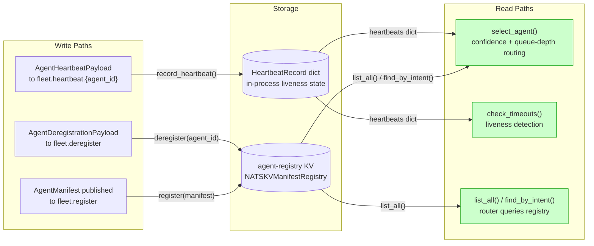
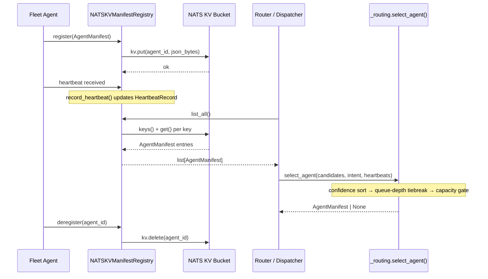
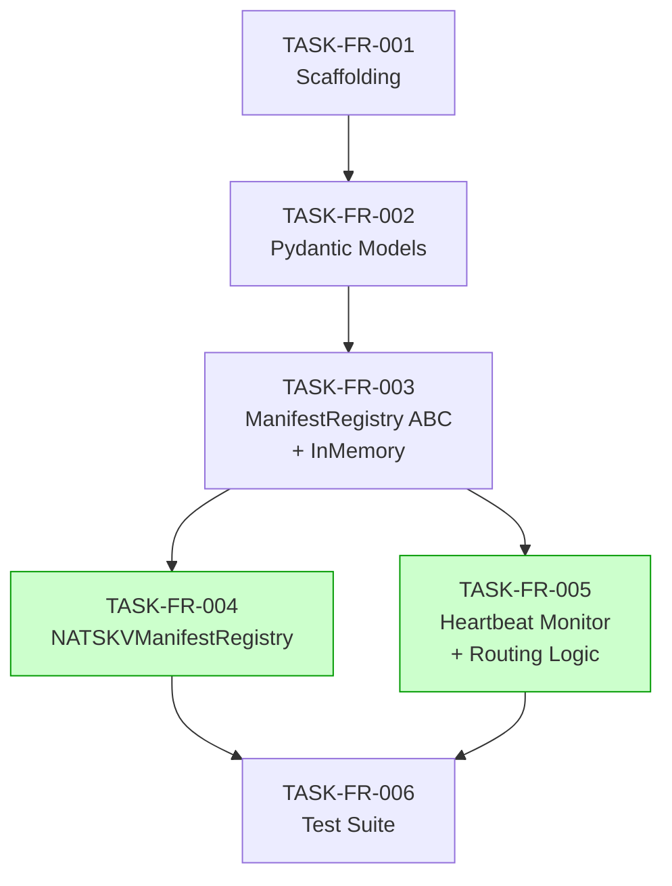

# Fleet Registration — Implementation Guide

**Feature ID:** FEAT-FR01
**Parent review:** TASK-B5F3
**Tasks:** 6 (5 waves)
**Approach:** Sequential waves with max in-wave parallelism
**Execution:** Auto-detect (Wave 4 eligible for parallel)
**Testing:** Standard (BDD-driven, `InMemoryManifestRegistry` for unit tests)

---

## Data Flow: Read/Write Paths

_All write paths have corresponding read paths. No disconnected paths._

---

## Integration Contracts

_Data passes from KV → Registry → Router → Routing at every dispatch. No fetch-then-discard._

---

## Task Dependencies

_TASK-FR-004 and TASK-FR-005 (green) can run in parallel in Wave 4 — no file conflicts._

---

## §4: Integration Contracts

Cross-task data dependencies that must be satisfied at integration boundaries.

### Contract: AgentManifest

- **Producer task:** TASK-FR-002
- **Consumer task(s):** TASK-FR-003, TASK-FR-006
- **Artifact type:** Python Pydantic model
- **Format constraint:** `from nats_core.manifest import AgentManifest` — the registry stores and retrieves instances of this model. Fields `agent_id`, `name`, `template` are required; `intents` must be non-empty at registration time.
- **Validation method:** Coach verifies `AgentManifest` is importable from `nats_core.manifest` and that `InMemoryManifestRegistry.register()` accepts it without error.

### Contract: ManifestRegistry ABC

- **Producer task:** TASK-FR-003
- **Consumer task(s):** TASK-FR-004, TASK-FR-005, TASK-FR-006
- **Artifact type:** Python Abstract Base Class
- **Format constraint:** `from nats_core.manifest import ManifestRegistry` — `NATSKVManifestRegistry` must subclass this ABC and implement all abstract methods: `register`, `deregister`, `get`, `list_all`, `find_by_intent`, `find_by_tool`. The routing functions in `_routing.py` receive a `ManifestRegistry` instance and call `list_all()` and `find_by_intent()`.
- **Validation method:** Coach verifies `issubclass(NATSKVManifestRegistry, ManifestRegistry)` is `True` and `mypy --strict` passes.

---

## Execution Strategy

### Wave 1 — Scaffolding (sequential)
- **TASK-FR-001**: Create `manifest.py`, `_routing.py`, `events/fleet.py` stubs, `py.typed`
- Duration: ~15 min

### Wave 2 — Models (sequential)
- **TASK-FR-002**: All Pydantic models with validators
- Duration: ~60 min

### Wave 3 — Registry Interface (sequential)
- **TASK-FR-003**: `ManifestRegistry` ABC + `InMemoryManifestRegistry`
- Duration: ~45 min

### Wave 4 — KV Registry + Routing (parallel)
- **TASK-FR-004**: `NATSKVManifestRegistry` in `client.py` (no overlap with `_routing.py`)
- **TASK-FR-005**: `select_agent`, `record_heartbeat`, `check_timeouts` in `_routing.py`
- Files are disjoint — safe to run in parallel
- Duration: ~90 min each

### Wave 5 — Test Suite (sequential)
- **TASK-FR-006**: All 28 BDD scenarios across 4 test files + conftest.py
- Duration: ~90 min

---

## Architecture Notes

### Module Placement

| Module | Path | Rationale |
|--------|------|-----------|
| Pydantic models | `src/nats_core/manifest.py` | Same file as ManifestRegistry — single import surface |
| Registry ABC + InMemory | `src/nats_core/manifest.py` | InMemory is a first-class impl, not test infra |
| NATS KV registry | `src/nats_core/client.py` | Consistent with NATSClient placement (both need nats-py) |
| Routing logic | `src/nats_core/_routing.py` | Private module — pure functions, no I/O |
| Fleet event payloads | `src/nats_core/events/fleet.py` | Domain-grouped with other event schemas |

### Key Design Decisions

1. **`ManifestRegistry` ABC enables `InMemoryManifestRegistry` as first-class impl** — not just a test double. Consumers running without NATS (e.g. local dev, unit tests) use it directly.

2. **Routing is pure** — `select_agent()` takes `candidates: list[AgentManifest]` and `heartbeats: dict[str, HeartbeatRecord]`. The caller queries the registry and passes results in. No async I/O inside routing.

3. **`time.monotonic()` for heartbeat timeouts** — avoids wall-clock drift and is safe under sleep/resume.

4. **`model_dump_json().encode()` for KV storage** — deterministic JSON bytes. `model_validate_json()` for deserialization.

5. **`extra="ignore"` on `AgentManifest`** — forward compatibility per ADR-002. Unknown fields in newer agent versions are silently dropped.

6. **Last-write-wins for concurrent registration** — NATS KV `put()` is atomic; the last writer wins. This is the documented behaviour per ADR-004 and the BDD `@concurrency` scenarios.

---

## Quality Gates

| Task | Type | Gate |
|------|------|------|
| TASK-FR-001 | scaffolding | File existence check; `python -c "import nats_core"` succeeds |
| TASK-FR-002 | declarative | mypy strict passes; Pydantic validators exercised |
| TASK-FR-003 | feature | `issubclass(InMemoryManifestRegistry, ManifestRegistry)`; seam test passes |
| TASK-FR-004 | feature | mypy strict; `issubclass(NATSKVManifestRegistry, ManifestRegistry)`; seam test passes |
| TASK-FR-005 | feature | mypy strict; routing unit tests pass; seam test passes |
| TASK-FR-006 | testing | All 28 tests pass; `pytest -m smoke` runs 3 tests; coverage >= 90% |
