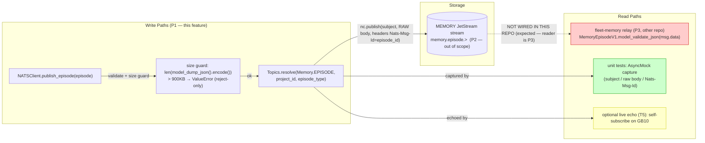
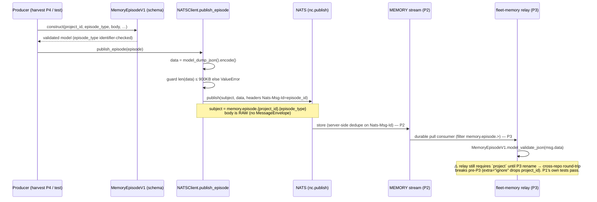
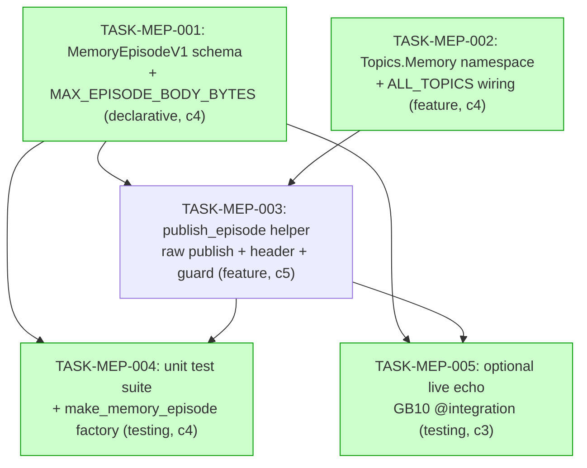

# Implementation Guide — Memory Episode Publisher (FEAT-MEP1)

> **Feature:** canonical framework-neutral `MemoryEpisodeV1` schema + `publish_episode()` helper for nats-core.
> **Part of:** the post-Graphiti memory write path (P1). Authoritative spec:
> `nats-infrastructure/docs/design/specs/memory-relay/memory-write-path-v2-post-graphiti.md` (§5 schema, §6 P1).
> **Review:** TASK-REV-MEP1 · **Overall complexity:** 5/10 · **Tasks:** 5 (3 waves).

This is **P1 (nats-core only)**. P2 (nats-infrastructure `MEMORY` stream + `fleet-memory` NATS user),
P3 (relay corrections + live verify), and P4 (guardkit harvest publisher) are downstream and **out of scope**.

---

## 1. Data Flow: Read/Write Paths (the primary review artifact)

_What to look for: every write path terminates either at the JetStream subject (production) or at an
in-repo verifier (tests). The one dotted edge is the production reader._

**Disconnection Alert (1 read path has no in-repo caller — ACKNOWLEDGED, NOT A DEFECT):**
The production reader (`R1`, the fleet-memory relay) lives in **another repo** and lands at **P3**. P1's
scope boundary is the write path; it is fully verifiable here via the AsyncMock unit round-trip (T4,
green) and the optional live self-consume echo (T5, yellow). **No task is added to wire R1** — doing so
would pull P3 into P1. This deferral is intentional and tracked by the build sequence (P1→P2→P3→P4).

---

## 2. Integration Contracts (sequence — required for complexity ≥ 5)

_What to look for: the body emitted at `nc.publish` is the exact bytes the relay decodes — no envelope in
between. The fetch-then-decode never drops data within P1; the only gap is the pre-P3 `project`/`project_id`
field-name mismatch (see §5 Risk R1)._

---

## 3. Task Dependencies

_Tasks with green background can run in parallel within their wave._

### Execution waves

| Wave | Tasks | Parallel? | Notes |
|------|-------|-----------|-------|
| 1 | TASK-MEP-001, TASK-MEP-002 | ✅ disjoint files (`events/_memory.py` vs `topics.py`) | foundation |
| 2 | TASK-MEP-003 | — | needs schema + topics |
| 3 | TASK-MEP-004, TASK-MEP-005 | ✅ disjoint files (`tests/*` vs `tests/integration/*`) | verification; T5 optional |

---

## 4. §4 Integration Contracts

### Contract: MemoryEpisodeV1 wire body — `memory.episode.{project_id}.{episode_type}`
- **Producer task:** TASK-MEP-001 (schema) + TASK-MEP-003 (publish)
- **Consumer task(s):** fleet-memory relay (P3, **other repo**); guardkit harvest (P4); jarvis (downstream)
- **Artifact type:** NATS message body (raw JSON) + `Nats-Msg-Id` header
- **Format constraint:** RAW `MemoryEpisodeV1` JSON as the message body — **NO** `MessageEnvelope`
  wrapping. Canonical field set: **required** `episode_id`, `project_id`, `episode_type`
  (NATS-safe identifier), `content_format` (raw `str`: `json`/`markdown`/`text`), `body`;
  **optional** `payload_type`, `source_ref`, `name`, `source`, `occurred_at`, `published_at`,
  `ingest_hints`. `group_id` **dropped**. `model_config = ConfigDict(extra="ignore")`.
  Header `Nats-Msg-Id == episode_id`. Serialized body `≤ 921600` bytes.
- **Validation method:** Coach verifies the published body re-parses via
  `MemoryEpisodeV1.model_validate_json` (and is **not** an envelope — no `payload` key), and that
  `headers["Nats-Msg-Id"] == episode_id` (seam test in TASK-MEP-003).
- **⚠️ Cross-repo mismatch:** the *built* relay requires `project` (not `project_id`). A true cross-repo
  round-trip fails until the P3 relay rename. P1 verifies against nats-core's own copy only.

### Contract: Topics.Memory namespace constants (intra-repo)
- **Producer task:** TASK-MEP-002 (`Topics.Memory.EPISODE`, `Topics.Memory.ALL`)
- **Consumer task(s):** TASK-MEP-003 (subject build via `Topics.resolve`); P2 stream subject filter
- **Artifact type:** Topic template + wildcard constant
- **Format constraint:** `EPISODE = "memory.episode.{project_id}.{episode_type}"` (non-wildcard →
  **in** `ALL_TOPICS`, count `27 → 28`); `ALL = "memory.episode.>"` (wildcard → **excluded** from
  `ALL_TOPICS`). `Memory` **must** be appended to the `ALL_TOPICS` source tuple at `topics.py:134`.
- **Validation method:** `Topics.resolve(...)` returns the partitioned subject; membership asserted
  (`EPISODE in ALL_TOPICS`, `ALL not in ALL_TOPICS`); `test_all_topics_count` updated `27 → 28`.

### Contract: MAX_EPISODE_BODY_BYTES (intra-repo)
- **Producer task:** TASK-MEP-001 (`MAX_EPISODE_BODY_BYTES = 900 * 1024 = 921600`)
- **Consumer task(s):** TASK-MEP-003 (guard); TASK-MEP-004 (boundary tests / factory)
- **Artifact type:** module-level `int` constant
- **Format constraint:** single shared constant; the guard measures the **full encoded model bytes**
  (`model_dump_json().encode()`), byte-identical to the transmitted bytes — **not** the `body` field alone.
- **Validation method:** boundary unit test — `> limit` raises `ValueError` (message names measured size +
  limit) and `publish` is not called; `< limit` publishes once.

---

## 5. Risks

| # | Risk | Severity | Mitigation |
|---|------|----------|------------|
| R1 | **Cross-repo round-trip break (sequencing).** Built relay requires `project`; canonical emits `project_id` and drops `project`. `extra="ignore"` silently discards `project_id` → relay `ValidationError` until P3. | **High** | Do **not** add a `project` compat alias to the canonical model. Land P3 (relay rename) immediately after P1; do not point a live relay at `memory.episode.*` until P3. Call out as a deploy-ordering constraint in the PR. P1's own tests pass. |
| R2 | **`ALL_TOPICS` silent-drop trap.** If `Memory` isn't appended to the 5-class tuple, `EPISODE` is excluded and **no test fails** (count still 27). | Medium | TASK-MEP-002 appends `Memory` to the tuple **and** asserts `EPISODE in ALL_TOPICS` / `ALL not in ALL_TOPICS`; bump `test_all_topics_count` 27→28 with comment block. |
| R3 | **Late `episode_type` validation.** A bad `episode_type` would raise inside `Topics.resolve` at publish, not at model build. | Medium | Constrain `episode_type` (and `project_id`) on the model (TASK-MEP-001); negative tests at both model and Topics level. |
| R4 | **AC wording.** Seed AC says "Body > 900KB"; the guard measures the full encoded model (the actual wire bytes). | Low (resolved) | Decision taken: measure the full encoded model. AC reworded in TASK-MEP-003/004. Body-only would be a latent bug. |
| R5 | **`max_payload` headroom.** The 900KB↔1MB headroom holds only if the negotiated `max_payload` stays at the default 1MB. | Low | Use the static constant for P1. Document that P2 `MEMORY`-stream/account provisioning must not lower `max_payload` below ~1MB without revisiting. |
| R6 | **Integration conftest coupling.** `tests/integration/conftest.py` hardcodes `PIPELINE_TEST` / `pipeline.>`. | Low | T5 is a self-contained core-NATS echo (no stream); does not reuse the pipeline fixtures. T5 is optional. |

---

## 6. Sequencing note for the PR

This feature is the **producer half** of a cross-repo contract. The PR description must state the
deploy-ordering constraint from R1: **P1 (this) → P3 (fleet-memory `project → project_id` rename) must
ship together or P3 immediately after**, and P2 (the `MEMORY` stream + `fleet-memory` NATS user) must
exist before any live relay consumption. Server-side `Nats-Msg-Id` dedupe is only enforced once the P2
stream exists — P1 only emits the header.
