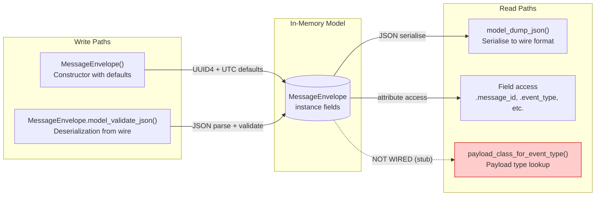
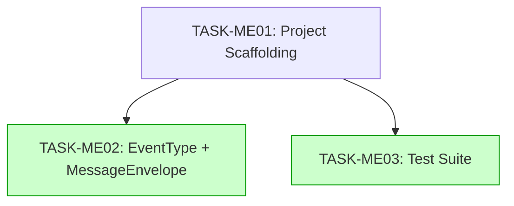

# Implementation Guide: Message Envelope

**Feature ID**: FEAT-ME
**Parent Review**: TASK-40B8
**Approach**: Scaffold-First, Then Envelope (Option 1)
**Execution**: Auto-detect parallel (Wave 1 sequential, Wave 2 parallel)
**Testing**: Standard (quality gates enforced)

---

## Data Flow: Read/Write Paths



**Disconnection Alert**: `payload_class_for_event_type()` is stubbed in this feature. It will be wired when event payload models are implemented in a future feature. This is intentional — the envelope feature scope covers the base schema only. The stub raises `NotImplementedError` to make the disconnection explicit.

---

## Task Dependencies



_Tasks with green background (Wave 2) can run in parallel after Wave 1 completes._

---

## Execution Strategy

### Wave 1: Foundation (Sequential)

| Task | Type | Complexity | Mode | Est. |
|------|------|-----------|------|------|
| TASK-ME01: Project scaffolding | scaffolding | 3 | direct | 30 min |

**What**: Create pyproject.toml, src/nats_core/ layout, tooling config (ruff, mypy, pytest).
**Why first**: All subsequent tasks need the project structure to exist.
**Verification**: `pip install -e ".[dev]"` succeeds, `ruff check .` and `mypy src/` pass.

### Wave 2: Model + Tests (Parallel)

| Task | Type | Complexity | Mode | Est. |
|------|------|-----------|------|------|
| TASK-ME02: EventType + MessageEnvelope | declarative | 4 | task-work | 45 min |
| TASK-ME03: Test suite (23 BDD scenarios) | testing | 4 | task-work | 60 min |

**Why parallel**: TASK-ME02 writes to `src/nats_core/envelope.py`, TASK-ME03 writes to `tests/test_envelope.py` and `tests/conftest.py` — no file conflicts. Both depend only on TASK-ME01 (project structure).

**Note on parallelism**: While these CAN run in parallel, TASK-ME03 imports from `nats_core.envelope` which TASK-ME02 creates. If running truly in parallel via Conductor, TASK-ME03 should either:
- Wait for TASK-ME02 to complete first (sequential in practice), OR
- Write tests against the spec, then verify imports after TASK-ME02 merges

**Recommended**: Run TASK-ME02 first, then TASK-ME03 immediately after for cleanest workflow.

---

## Key Architecture Decisions

| Decision | Resolution | Reference |
|----------|-----------|-----------|
| Wire format | JSON via Pydantic model_dump_json / model_validate_json | System Spec |
| Forward compat | `ConfigDict(extra="ignore")` | ADR-002 |
| message_id | UUID v4 string via default_factory | System Spec, ASSUM-002 |
| EventType | `str, Enum` subclass (16 values, 4 domains) | DM-message-contracts |
| payload type | `dict[str, Any]` (typed payloads at event level) | ASSUM-003 |
| source_id | Required, min_length=1 | ASSUM-001 |

---

## File Map

```
src/nats_core/
├── __init__.py          ← Public API re-exports (TASK-ME01 creates, TASK-ME02 updates)
├── py.typed             ← PEP 561 marker (TASK-ME01)
├── envelope.py          ← MessageEnvelope + EventType (TASK-ME02)
└── events/
    └── __init__.py      ← Empty sub-package placeholder (TASK-ME01)

tests/
├── __init__.py          ← (TASK-ME01)
├── conftest.py          ← Factory functions (TASK-ME01 skeleton, TASK-ME03 populates)
└── test_envelope.py     ← 23 BDD scenario tests (TASK-ME03)
```

---

## Quality Gates

| Task | Lint | Type Check | Tests | Coverage |
|------|------|-----------|-------|----------|
| TASK-ME01 | ruff check . = 0 errors | mypy src/ = 0 errors | N/A (no tests yet) | N/A |
| TASK-ME02 | ruff check . = 0 errors | mypy src/ = 0 errors | N/A (tests in ME03) | N/A |
| TASK-ME03 | ruff check . = 0 errors | mypy src/ = 0 errors | pytest = 23 pass | >= 95% envelope.py |

---

## Risk Assessment

| Risk | Likelihood | Impact | Mitigation |
|------|-----------|--------|------------|
| Pydantic v2 datetime serialisation quirks | Low | Medium | Use `model_serializer` if default ISO 8601 format doesn't match spec |
| UUID4 collisions in concurrent test | Negligible | Low | UUID4 space is 2^122, statistically impossible |
| EventType enum not extensible | Low | Low | ADR-002 allows adding new values as non-breaking |
| mypy strict mode friction with Pydantic | Medium | Low | Use pydantic mypy plugin in pyproject.toml |
