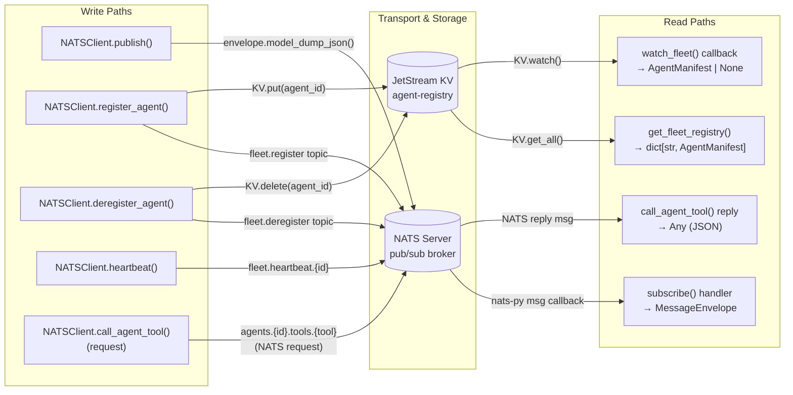
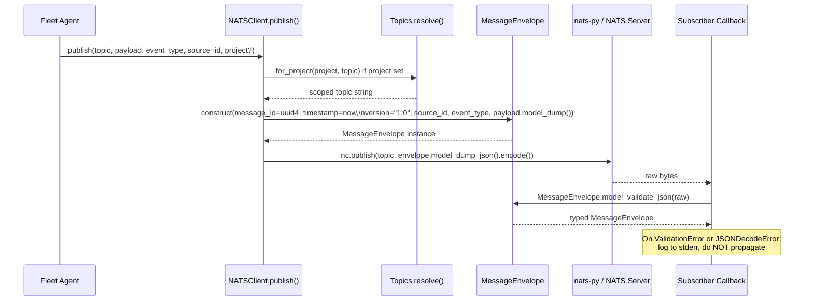
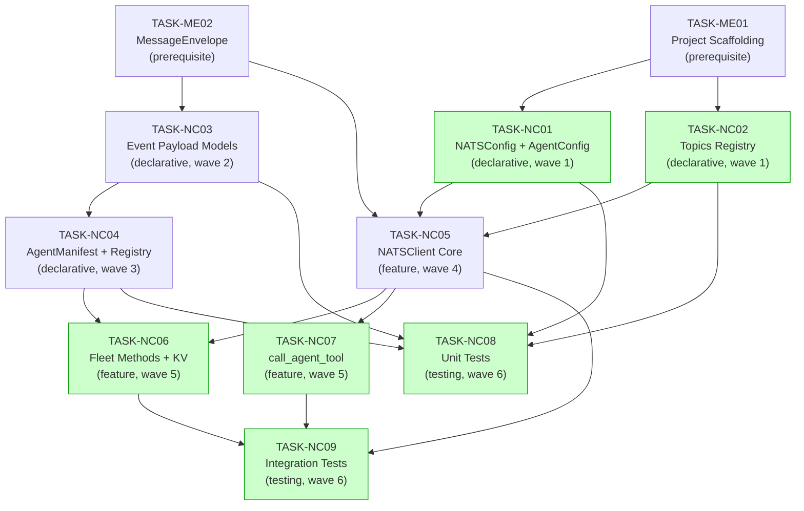

# Implementation Guide: NATS Client

**Feature:** NATS Client (`FEAT-1T1W`)
**Review task:** TASK-1T1W
**Approach:** Layered Declarative-First Build
**Estimated effort:** 3–4 days
**Overall complexity:** 7/10

---

## Data Flow: Read/Write Paths



_All write paths have a corresponding read path. No disconnections._

---

## Integration Contracts: Publish Path



_Key: `payload.model_dump()` goes into `envelope.payload` — it cannot override envelope-level fields._

---

## Task Dependencies



_Green tasks can run in parallel within their wave._

---

## §4: Integration Contracts

### Contract: NATSConfig Python API

- **Producer task:** TASK-NC01
- **Consumer task(s):** TASK-NC05
- **Artifact type:** Python module (`nats_core.config.NATSConfig`)
- **Format constraint:** `NATSConfig()` must instantiate without args using env var defaults; must expose `url: str`, `connect_timeout: float`, `max_reconnect_attempts: int`, `reconnect_time_wait: float`, `name: str`, `user: str | None`, `password: str | None`, `creds_file: str | None` — all passed directly to `nats.connect()`
- **Validation method:** Coach verifies NC05 imports `NATSConfig` and all fields are used in `connect()` call; seam test in NC05 checks field types

### Contract: Topics Python API

- **Producer task:** TASK-NC02
- **Consumer task(s):** TASK-NC05, TASK-NC06, TASK-NC07
- **Artifact type:** Python module (`nats_core.topics.Topics`)
- **Format constraint:** `Topics.resolve(template, **kwargs) -> str` — no `{placeholder}` tokens in output; raises `KeyError` on missing kwargs, `ValueError` on wildcard chars; `Topics.for_project(project, topic) -> str` prepends `{project}.`
- **Validation method:** Coach verifies NC05 calls `Topics.for_project()` when `project` arg is set; seam tests in NC05 verify resolution output format

### Contract: MessageEnvelope Python API

- **Producer task:** TASK-ME02
- **Consumer task(s):** TASK-NC03, TASK-NC05
- **Artifact type:** Python module (`nats_core.envelope.MessageEnvelope`, `nats_core.envelope.EventType`)
- **Format constraint:** `MessageEnvelope.model_dump_json()` → valid JSON string; `MessageEnvelope.model_validate_json(raw: bytes | str)` → typed instance; `EventType` enum values match wire format event type strings (snake_case)
- **Validation method:** Seam test in NC03 and NC05 verifies round-trip JSON encoding; NC05 constructs envelope with all required fields

### Contract: AgentManifest Python API

- **Producer task:** TASK-NC04
- **Consumer task(s):** TASK-NC06
- **Artifact type:** Python module (`nats_core.manifest.AgentManifest`, `nats_core.manifest.ManifestRegistry`)
- **Format constraint:** `AgentManifest.model_dump_json().encode()` → UTF-8 bytes valid for NATS KV put; `AgentManifest.model_validate_json(raw_bytes)` → typed instance for `get_fleet_registry()` deserialization
- **Validation method:** Seam test in NC06 verifies encode→decode round-trip; Coach verifies `NATSKVManifestRegistry` implements all `ManifestRegistry` abstract methods

### Contract: NATSClient Core API

- **Producer task:** TASK-NC05
- **Consumer task(s):** TASK-NC06, TASK-NC07
- **Artifact type:** Python class (`nats_core.client.NATSClient`)
- **Format constraint:** `NATSClient._nc` must be non-None after `connect()`; fleet methods and `call_agent_tool()` access JetStream via `_nc.jetstream()` and request/reply via `_nc.request()`; all methods must raise `RuntimeError("client is not connected")` when `_nc is None`
- **Validation method:** Seam tests in NC06 and NC07 verify `_nc` initial state; Coach verifies all new methods guard on `_nc is None` before use

---

## Execution Waves

| Wave | Tasks | Can Parallelise? | NATS Server Needed? |
|------|-------|-----------------|---------------------|
| Pre | TASK-ME01, TASK-ME02 | Yes | No |
| 1 | NC01, NC02 | Yes | No |
| 2 | NC03 | Single | No |
| 3 | NC04 | Single | No |
| 4 | NC05 | Single (critical path) | Yes (for manual testing) |
| 5 | NC06, NC07 | Yes | Yes |
| 6 | NC08, NC09 | Yes | NC09 needs NATS |

---

## Risk Register

| Risk | Likelihood | Impact | Mitigation |
|------|-----------|--------|------------|
| nats-py KV watch API changes between versions | Low | Medium | Pin nats-py version; check `nats-py>=2.4.0` for KV support |
| Slow consumer backpressure hard to test | Medium | Low | Use nats-py mock or integration test skip marker |
| Reconnection window message loss hard to simulate | Medium | Medium | Mark edge-case tests; use `nats-server -js` with Docker for controlled disconnection |
| `watch_fleet()` async iterator leaks if not cancelled | Medium | Medium | Document `asyncio.create_task()` pattern; add cancellation test to NC09 |
| Concurrent KV register+deregister race | Low | Medium | NATS KV is sequentially consistent per key — document this guarantee |

---

## Architecture Constraints

- **ADR-003:** `NATSClient` wraps nats-py only — no FastStream, no aioredis, no other broker
- **ADR-004:** Dynamic Fleet Registration via NATS KV `agent-registry` bucket
- **Dependency direction:** `Config → Client → Topics → Events → Envelope` (no upward imports)
- **`AgentConfig` isolation:** Never appears in `AgentManifest`, never published to fleet
- **Error handling:** All subscriber errors go to `stderr` via `logging` — never `print()`

---

## Quick Start

```bash
# Prerequisites
pip install -e ".[dev]"

# Start NATS with JetStream (for integration tests)
nats-server -js

# Run unit tests (no NATS required)
pytest tests/ -m unit -v

# Run smoke integration tests
pytest tests/ -m "smoke and integration" -v

# Run full suite
pytest tests/ -v --cov=src/nats_core --cov-report=term-missing
```
