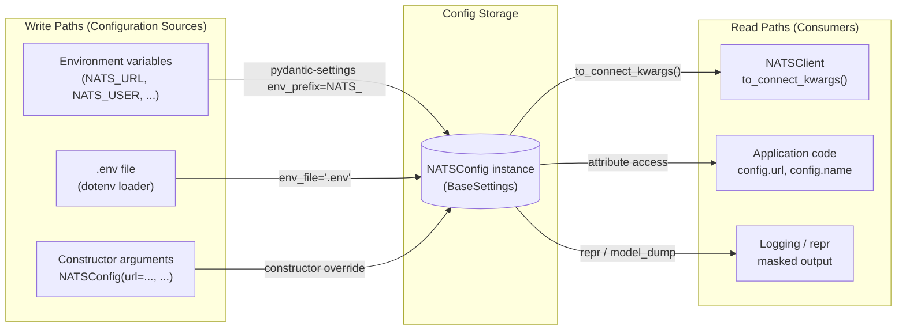
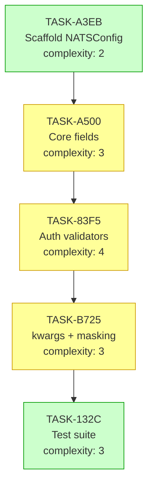

# Implementation Guide: NATS Configuration

**Feature:** FEAT-NC — NATSConfig pydantic-settings module
**Parent review:** TASK-F7AE
**Approach:** Pure pydantic-settings BaseSettings (Option 1)
**Execution:** Sequential (5 waves)
**Testing:** Standard (alongside implementation, full unit coverage)

---

## Data Flow: Read/Write Paths



_All three write paths feed a single `NATSConfig` instance. All three read paths are wired — no disconnections._

---

## Integration Contracts

_NATSConfig is an independent module (no cross-task data dependencies within this feature). All tasks produce or extend the same `NATSConfig` class directly — no task produces an artifact consumed by another task via an interface boundary._

_No §4 Integration Contracts required for this feature._

---

## Task Dependency Graph



_Green = straightforward. Yellow = requires attention (validators, SecretStr, cross-field logic)._

---

## Execution Strategy

Sequential — 5 waves (each task depends on the previous):

| Wave | Task | Type | Complexity | Mode |
|------|------|------|-----------|------|
| 1 | TASK-A3EB — Scaffold NATSConfig module | scaffolding | 2 | direct |
| 2 | TASK-A500 — Core connection fields | declarative | 3 | task-work |
| 3 | TASK-83F5 — Auth fields + validators | feature | 4 | task-work |
| 4 | TASK-B725 — kwargs output + masking | feature | 3 | task-work |
| 5 | TASK-132C — Test suite | testing | 3 | task-work |

---

## Architecture Notes

### Module Location

```
src/nats_core/
└── config.py          ← sole output of this feature
tests/
└── test_config.py     ← sole test file
```

### Class Structure

```python
from __future__ import annotations

from typing import Any
from pydantic import BaseModel, Field, SecretStr, field_validator, model_validator
from pydantic_settings import BaseSettings, SettingsConfigDict
from typing import Self


class NATSConfig(BaseSettings):
    """NATS connection configuration loaded from environment or constructor."""

    model_config = SettingsConfigDict(env_prefix="NATS_", env_file=".env")

    # Core connection fields (TASK-A500)
    url: str = Field(default="nats://localhost:4222", description="NATS server URL")
    connect_timeout: float = Field(default=5.0, ge=0.0, description="...")
    reconnect_time_wait: float = Field(default=2.0, ge=0.0, description="...")
    max_reconnect_attempts: int = Field(default=60, ge=0, description="...")
    name: str = Field(default="nats-core-client", min_length=1, description="...")

    # Auth fields (TASK-83F5)
    user: str | None = Field(default=None, description="...")
    password: SecretStr | None = Field(default=None, description="...")
    creds_file: str | None = Field(default=None, description="...")

    # Validators (TASK-A500 + TASK-83F5)
    @field_validator("url")
    @classmethod
    def url_must_use_nats_scheme(cls, v: str) -> str: ...

    @field_validator("creds_file")
    @classmethod
    def creds_file_no_traversal(cls, v: str | None) -> str | None: ...

    @model_validator(mode="after")
    def check_auth_completeness(self) -> Self: ...

    # Output (TASK-B725)
    def to_connect_kwargs(self) -> dict[str, Any]: ...
```

### Key Design Decisions

| Decision | Rationale |
|---|---|
| `SecretStr` for `password` | Automatic masking in repr and model_dump — zero boilerplate |
| `env_prefix="NATS_"` | All 23 env-var BDD scenarios handled by pydantic-settings |
| `@model_validator(mode="after")` | Cross-field auth validation needs all fields populated |
| `servers: list` in kwargs | nats-py `connect()` accepts both str and list — list is canonical |
| `@pytest.mark.integration` on nats-py test | CI runs without NATS server; integration test opt-in |

---

## Testing Strategy

- **Factory:** `make_nats_config(**overrides)` in `tests/conftest.py`
- **Env vars:** `monkeypatch.setenv` — never mutate `os.environ` directly
- **.env files:** `tmp_path / ".env"`, pass as `_env_file` kwarg to constructor
- **Smoke gate:** `pytest -m smoke` covers the 2 @smoke scenarios for CI
- **Integration:** `pytest -m integration` requires a live NATS server

---

## BDD Scenario Coverage Matrix

| Category | Count | Tasks |
|---|---|---|
| @key-example + @smoke | 5 (2 smoke) | TASK-A500, TASK-83F5 |
| @boundary | 6 | TASK-A500 |
| @negative | 8 | TASK-A500, TASK-83F5 |
| @edge-case | 8 | TASK-83F5, TASK-B725 |
| **Total** | **23** | |

---

## Next Steps

1. Start: `/task-work TASK-A3EB`
2. Then: `/task-work TASK-A500`
3. Then: `/task-work TASK-83F5`
4. Then: `/task-work TASK-B725`
5. Then: `/task-work TASK-132C`
6. Complete: `/task-complete` each task as it passes
