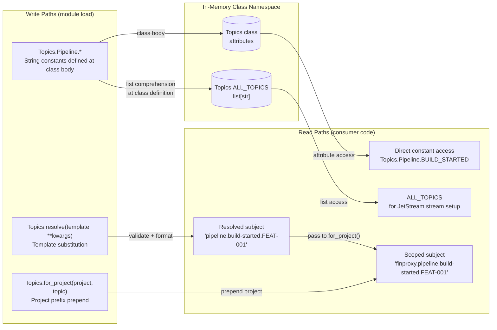
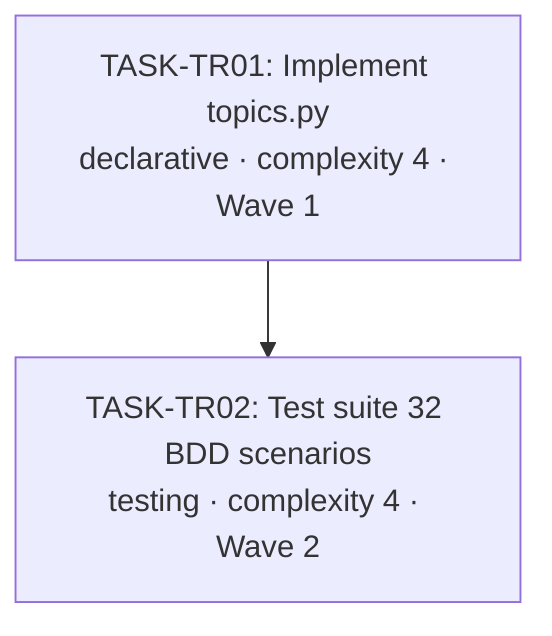

# Implementation Guide: Topic Registry

**Feature ID**: FEAT-TR
**Parent Review**: TASK-TR00
**Approach**: Nested class-based registry (Option 1)
**Execution**: Sequential (TR01 → TR02, import dependency)
**Testing**: Standard (implement first, then tests)

---

## Data Flow: Read/Write Paths



_All write paths are connected — no disconnected read paths. `ALL_TOPICS` is fully wired at class definition time._

---

## §4: Integration Contracts

### Contract: nats_core.topics

- **Producer task:** TASK-TR01 (Implement topics.py)
- **Consumer task(s):** TASK-TR02 (Test suite)
- **Artifact type:** Python module import
- **Format constraint:** `from nats_core.topics import Topics` must succeed after `pip install -e '.[dev]'`; `Topics` class must expose `Pipeline`, `Agents`, `Fleet`, `Jarvis`, `System` as inner class attributes with typed string constants matching the API contract in `docs/design/contracts/API-topic-registry.md`
- **Validation method:** TASK-TR02 seam test `test_nats_core_topics_importable` verifies importability and namespace presence before proceeding with the full 32-scenario test suite

---

## Task Dependencies



_TASK-TR02 imports `Topics` from TASK-TR01 — sequential execution required. Run TR01 to completion before starting TR02._

---

## Execution Strategy

### Wave 1: Implementation (Sequential)

| Task | Type | Complexity | Mode | Est. |
|------|------|-----------|------|------|
| TASK-TR01: Implement topics.py | declarative | 4 | task-work | 60 min |

**What**: `src/nats_core/topics.py` — 5 namespace inner classes, 24 topic constants, `resolve()`, `for_project()`, identifier validation, `ALL_TOPICS` list.
**Verification**: `from nats_core.topics import Topics` succeeds; `ruff check` and `mypy src/` pass.

### Wave 2: Test Suite (Sequential, after Wave 1)

| Task | Type | Complexity | Mode | Est. |
|------|------|-----------|------|------|
| TASK-TR02: Test suite (32 BDD scenarios) | testing | 4 | task-work | 90 min |

**What**: `tests/test_topics.py` — all 32 BDD scenarios, 8 smoke-marked, seam test, factory helpers in conftest.py.
**Verification**: `pytest tests/test_topics.py -v` (32 pass); `pytest -m smoke` (8 pass); coverage ≥ 95%.

---

## Key Architecture Decisions

| Decision | Resolution | Source |
|----------|-----------|--------|
| Class structure | Outer `Topics` class + 5 inner namespace classes | API contract |
| Access pattern | Class attributes (no instantiation needed) | BDD spec scenario |
| Resolution mechanism | `@staticmethod resolve()` with `str.format`-style template substitution | API contract |
| Identifier validation | Blocklist: empty, dots, spaces, `*`, `>`, control chars, shell metacharacters | BDD scenarios (negative cases) |
| Wildcard constants | Template strings containing `>` — NOT resolvable (return as-is or excluded from resolve) | API contract + spec |
| ALL_TOPICS | List comprehension over inner class vars, excluding wildcards (`>`, `*`) | API contract |
| EventType sync | Verified in tests, NOT enforced at runtime in topics.py | YAGNI principle |
| Immutability | `__setattr__` override on inner classes OR test verifies value unchanged | BDD spec edge-case |

---

## File Map

```
src/nats_core/
└── topics.py          ← TASK-TR01 (new file)

tests/
├── conftest.py        ← TASK-TR02 (extend with topic factory helpers)
└── test_topics.py     ← TASK-TR02 (new file, 32 BDD scenarios)
```

---

## Quality Gates

| Task | Lint | Type Check | Tests | Coverage |
|------|------|-----------|-------|----------|
| TASK-TR01 | ruff check . = 0 errors | mypy src/ = 0 errors | N/A (tests in TR02) | N/A |
| TASK-TR02 | ruff check . = 0 errors | mypy src/ = 0 errors | pytest 32 pass, smoke 8 pass | ≥ 95% topics.py |

---

## Risk Assessment

| Risk | Likelihood | Impact | Mitigation |
|------|-----------|--------|------------|
| `resolve()` accidentally treats `*` in `ALL_BUILDS` as a placeholder | Medium | Medium | Only match `{word}` patterns — `*` is not in braces |
| mypy strict rejects `__setattr__` override for immutability | Low | Low | Use alternative: document that Python allows reassignment, test checks value is unchanged |
| EventType enum location changes (Feature 2 module structure) | Low | Low | TR02 test imports EventType dynamically — adjust import path if needed |
| Identifier validation regex too strict (rejects valid kebab-case agent IDs) | Low | Medium | BDD spec confirms `my-agent-v2-01` must be valid — allow hyphens explicitly |
